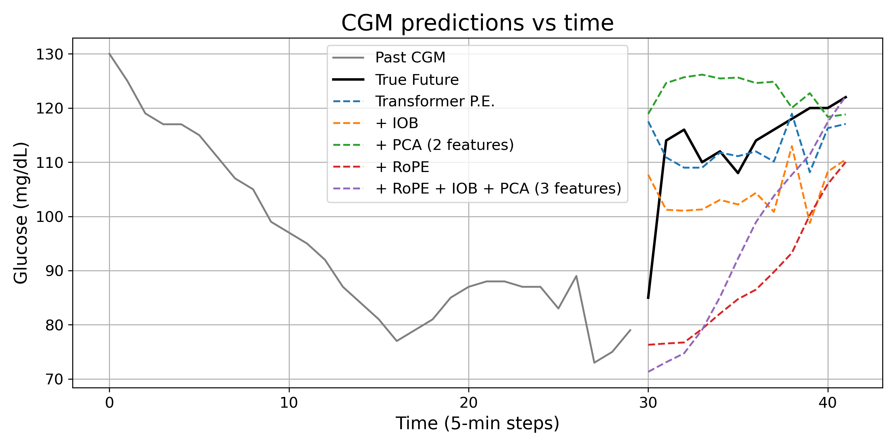

# GlucoseFormer

## Overview

GlucoseFormer is a time-series Transformer-based model designed to forecast continuous glucose monitoring (CGM) levels. To enhance prediction accuracy and interpretability, the model incorporates:

- **[RoPE (Rotary Positional Encoding)](https://arxiv.org/abs/2104.09864)**  
  Improves the model’s ability to understand time-based relationships by encoding relative position information—ideal for long context windows.

- **IOB (Insulin on Board)**  
  Simulates the decaying effect of bolus insulin over time, helping the model factor in insulin that is still active in the body.

- **PCA (Principal Component Analysis)**  
  Reduces the dimensionality of input features while preserving critical information, which improves generalization and training speed.

## Dataset

This project uses the publicly available dataset from:

**[The Insulin-Only Bionic Pancreas Pivotal Trial: Testing the iLet in Adults and Children with Type 1 Diabetes](https://public.jaeb.org/datasets/diabetes)**  
Hosted by the JAEB Center for Health Research.

---

Feel free to explore the codebase for training scripts, evaluation metrics, and visualizations of the model’s performance under different configurations.

