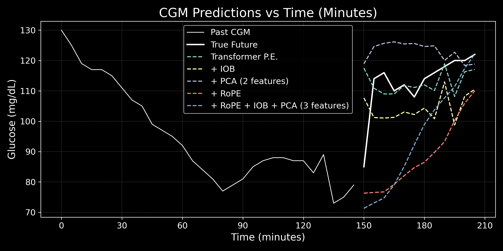
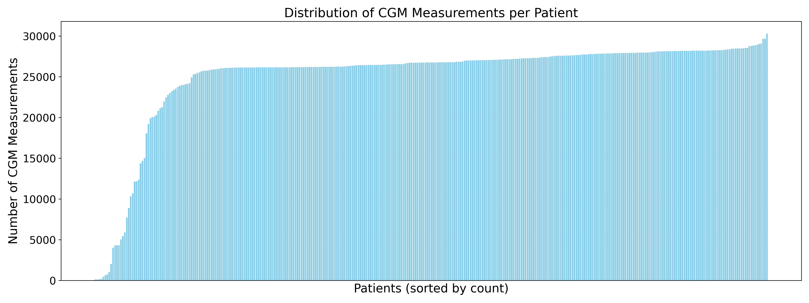

# GlucoseFormer 📈

## Overview

GlucoseFormer is a time-series Transformer-based model designed to forecast continuous glucose monitoring (CGM) levels. To enhance prediction accuracy and interpretability, the model incorporates:

- **[RoPE (Rotary Positional Encoding)](https://arxiv.org/abs/2104.09864)**  
  Improves the model’s ability to understand time-based relationships by encoding relative position information—ideal for long context windows.

- **IOB (Insulin on Board)**  
  Simulates the decaying effect of bolus insulin over time, helping the model factor in insulin that is still active in the body.

- **PCA (Principal Component Analysis)**  
  Reduces the dimensionality of input features while preserving critical information, which improves generalization and training speed.

We train 5 variants of the vanilla transformer model on 3 different context lengths (2.5 hr, 5hr, and 10hr).

## Dataset

This project uses the publicly available dataset from:

**[The Insulin-Only Bionic Pancreas Pivotal Trial: Testing the iLet in Adults and Children with Type 1 Diabetes](https://public.jaeb.org/datasets/diabetes)**  
Hosted by the JAEB Center for Health Research.

---

## Data analysis

The dataset includes continuous glucose monitoring (CGM) data recorded every 5 minutes for a cohort of 343 patients. One of the most notable characteristics is the wide variability in the number of CGM readings per patient, ranging from just 122 to over 28,000 entries. This variance reflects the differing durations of patient participation in the clinical trial.

To better understand this distribution, we visualize the number of CGM measurements per patient below:

This distribution reveals a diverse set of data points across patients. However, to mitigate the risk of overfitting to patients with disproportionately large data volumes, we adopted a non-overlapping window strategy when constructing model input sequences.

In addition to glucose measurements, the dataset also includes detailed records of Basal and Bolus insulin deliveries—both in terms of dosage and frequency. To visualize these clinical interventions, we plot vertical markers over time, corresponding to each insulin delivery event in a sample patient’s timeline.

## Feature Engineering

With frequent bolus injections happening, we introduce a new variable which incorporated the decay rate of Insulin on Board (IOB). 

This helps our time-series transformer learn adapt and account for this variable, as it is something which directly impacts future CGM measurments. Here's an example of how this new varaiable behaves compared to cgm readings

## Dimensionality Reduction

To manage the complexity of high-dimensional input data, we apply **Principal Component Analysis (PCA)** to reduce the input feature space to either 2 or 3 principal components. This helps improve generalization and training efficiency without significant loss of information.

> 📘 Learn more about [PCA here](https://en.wikipedia.org/wiki/Principal_component_analysis).

## Data Processing

We use this [script](process_data.py) to process our data into different lengths. Here's an example of one of our splits, where a 5 hour context window was used to create 4 sequences.

One consideration to make is, as we varying our context length (2.5hr, 5hr, 10hr), the amount of training sequences changes. Below is a table of our splits

| Context Window | Train Sequences | Val Sequences | Test Sequences |
|----------------|------------------|----------------|-----------------|
| 2.5 hours      | 63,525           | 7,940          | 7,942           |
| 5 hours        | 28,514           | 3,564          | 3,565           |
| 10 hours       | 6,909            | 863            | 865             |

This allows us to understand the requirements for data and number of parameters for our model.

## Model Training

For consistency, we use a 3.1 million parameter transformer for each sequence length. There was consideration of increasing our MLP layer dimensions as we add IOB or more data, but this was outside the scope of this study. Here's the parameters

| Parameter         | Value | Description                                         |
|-------------------|-------|-----------------------------------------------------|
| `input_size`      | 4     | Number of input features (e.g., CGM, basal, bolus, iob)  |
| `d_model`         | 256   | Embedding dimension for each token                 |
| `nhead`           | 8     | Number of attention heads                          |
| `num_layers`      | 4     | Number of Transformer encoder layers               |
| `dim_feedforward` | 1024  | Hidden size of the MLP (position-wise feedforward) |
| `dropout`         | 0.2   | Dropout probability used across layers             |

Here's the train/val losses for each model

Analysis: The 10-hour context window setup suffers from limited data availability, which constrains the model’s ability to minimize loss during training. In contrast, the 5-hour and 2.5-hour configurations benefit from denser data coverage, enabling better learning performance.

